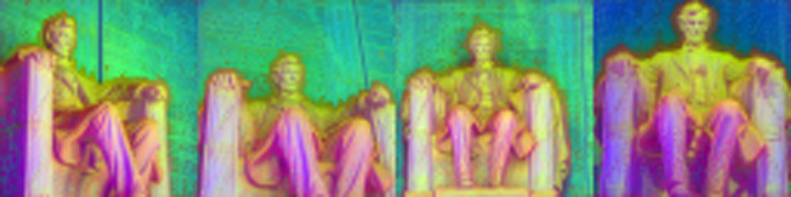
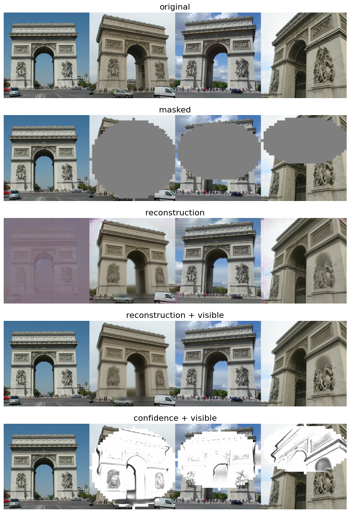

<div align="center">
<h1>Muskie: Multi-view Masked Image Modeling for 3D Vision Pre-training</h1>

<a href="https://jytime.github.io/data/VGGT_CVPR25.pdf" target="_blank" rel="noopener noreferrer">
  
</a>
<a href="https://arxiv.org/abs/2511.18115"></a>
<a href="https://leo-frank.github.io/Muskie/"></a>
<!-- <a href='https://huggingface.co/spaces/facebook/vggt'></a> -->


**Wenyu Li**<sup>†</sup>, **Sidun Liu**<sup>†</sup>, **Peng Qiao**<sup>\*</sup>, **Yong Dou**<sup>\*</sup>, **Tongrui Hu**

</div>

## Overview
Muskie is a native multi-view vision backbone designed for 3D vision tasks.
Unlike existing models, which are frame-wise and exhibit limited multi-view consistency, Muskie is designed to process multiple views simultaneously and introduce multi-view consistency in pre-training stage. 
Using Muskie as a backbone consistently enhances performance on downstream 3D tasks.

Here we provide PCA visualizations of learned features and comparison with DINOv3.

<div align="center">
    
    <br>
    <div style="color:gray; border-bottom: 0.5px solid #d9d9d9; display: inline-block; margin-bottom: 5px;">
        Input Images
    </div><br>
    
    <br>
    <div style="color:gray; border-bottom: 0.5px solid #d9d9d9; display: inline-block; margin-bottom: 5px;">
        Muskie
    </div><br>
    
    <br>
    <div style="color:gray; border-bottom: 0.5px solid #d9d9d9; display: inline-block; margin-bottom: 5px;">
        DINOv3
    </div>

</div>

## Demo
We provide a demo script to visualize the reconstruction from masked views in [muskie-visualize.ipynb](./muskie-visualize.ipynb). The pretrained weights can be downloaded from [here](https://drive.google.com/drive/folders/1uKXUlAwE66Wdes_fykKVNjuP1wDxBylg?usp=drive_link).

<div align="center">
  
</div>

## Train <u>Muskie-powered</u> Feed-Forward 3D Reconstruction Model

Use the following codes to reproduce the same configuration as our paper:
```shell
# Muskie-L as encoder, 4 layers decoder, DPT head to output 3D attributes
torchrun --nproc_per_node 8 train_ffrecon.py \
        model_name=muskie_large \
        model.decoder_depth=2 \
        train.batch_size=2 \
        train.optimizer.warmup_epochs=2 \
        train.optimizer.lr=4e-5 \
        paths.output_dir=./output_dir/ffrecon/muskie_large_4layers/
```
To resume training, add option like ```train.resume=./output_dir/ffrecon/muskie_large_4layers/checkpoint-latest.pth```

You can change the model.decoder_depth to a larger number to get better 3D reconstruction. We provide an example here that train a model with 40 decoder layer, which has similar size with VGGT and &pi;³.
```shell
torchrun --nproc_per_node 8 train_ffrecon.py train.epochs=200 enable_checkpoint=True \
        model_name=muskie_large \
        model.decoder_depth=20 \
        train.batch_size=4 \
        train.optimizer.warmup_epochs=2 \
        train.optimizer.lr=4e-5 \
        paths.output_dir=./output_dir/ffrecon/muskie_large_40layers/
```
## Pre-training

The pre-training takes about two weeks for Muskie-L and one week for Muskie-B on 8 A100 GPUs.

Train Muskie-B with following codes:
```shell
torchrun --nproc_per_node 8 main.py --warmup_epochs 2 \
         --model base --epochs 400 --epoch_size 100_000 --batch_size 4 \
         --lr 2e-4 --input_size_list 224 384 512 --log_dir output_dir/base \
         --output_dir output_dir/base \
         --mask_mode random rectangle ellipse \
         --mask_ratio 0.9 0.75 0.75 \
         --dynamic_batch
```
Train Muskie-L with following codes:
```shell
torchrun --nproc_per_node 8 main.py --warmup_epochs 2 \
         --model large --epochs 400 --epoch_size 100_000 --batch_size 16 \
         --lr 2e-4 --input_size_list 224 384 512 --log_dir output_dir/large \
         --output_dir output_dir/large \
         --mask_mode random rectangle ellipse \
         --mask_ratio 0.9 0.75 0.75 \
         --dynamic_batch --enable_checkpoint
```

## Checklist

<!-- - [ ] Release the training code for downstream tasks -->
- [ ] Release the evaluation code for multi-view consistency
- [ ] Release Muskie-Huge

## BibTeX
```bibtex
@misc{li2025muskiemultiviewmaskedimage,
        title={Muskie: Multi-view Masked Image Modeling for 3D Vision Pre-training}, 
        author={Wenyu Li and Sidun Liu and Peng Qiao and Yong Dou and Tongrui Hu},
        year={2025},
        eprint={2511.18115},
        archivePrefix={arXiv},
        primaryClass={cs.CV},
        url={https://arxiv.org/abs/2511.18115}
}
```